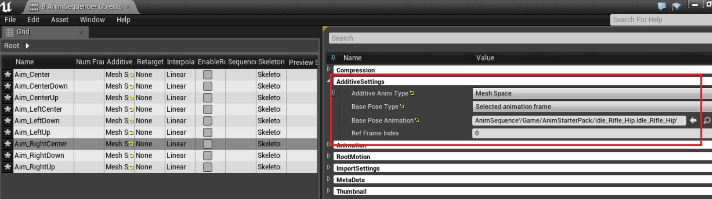
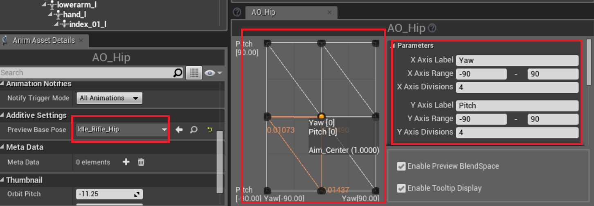

# エイムオフセット

## 1フレームのシーケンスを作成

* Aim_Space_Hip, Aim_Space_Ironsights を Shooter/Animation/AimOffset/ へコピー
* 1フレームのアニメーションシーケンスを切り出して9個作成する ... ()内はフレーム
    * Aim_Center(0), Aim_CenterUp(10), Aim_CenterDown(20), 
    * Aim_LeftCenter(35), Aim_LeftUp(40), Aim_LeftDown(50), 
    * Aim_RightCenter(65), Aim_RightUp(71), Aim_RightDown(81)
* シーケンスアセットをすべて選択して AdditiveSettings を以下のようにする

## エイムオフセットの作成 

* AO_Hip, AO_Ironsights を作成
