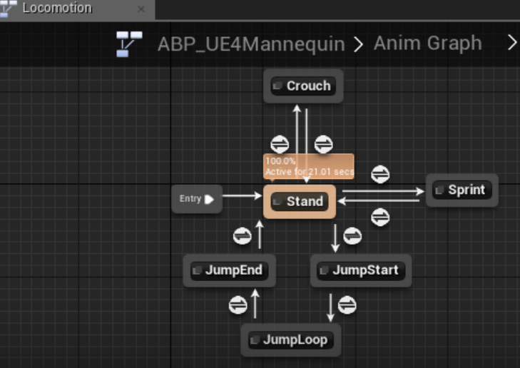
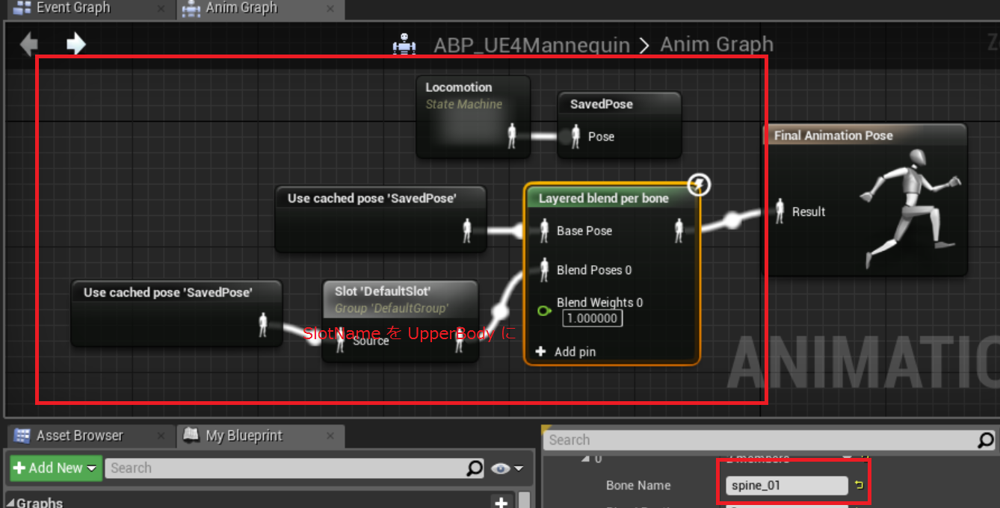
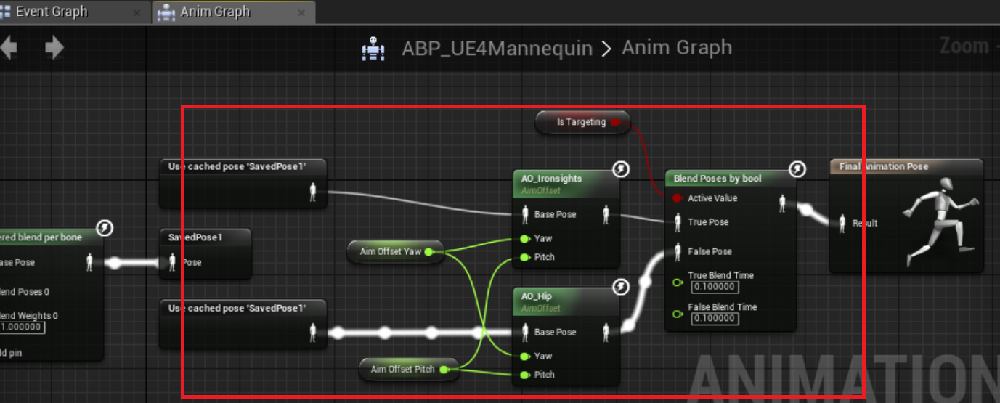
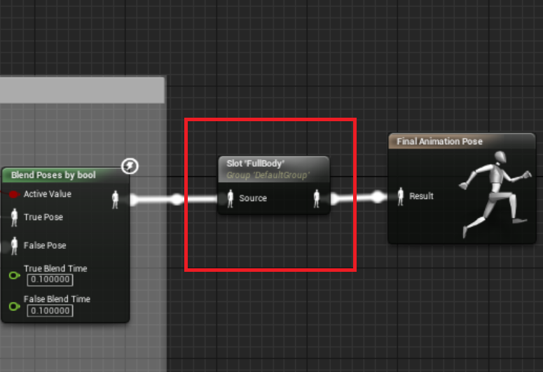

# アニメーションBP

## ABP_UE4Mannequin を作成

* AnimGraph にステートマシン(Locomotion)を作成
* ステートを追加、接続を行う (条件式はC++からやるので書かない)
	* Stand
		* BS_Stand をアサイン
		* Speed, Direction を接続 
			* 変数はShow Inherited Variablesにチェックを入れないと出てこないので注意
	* Crouch
		* BS_Crouch をアサイン
		* Speed, Direction を接続
	* JumpStart, JumpLoop, JumpEnd
		* Jump/Stand/Jump_Start, Jump_Loop, Jump_End をアサイン
		* Jog や Ironsights からのジャンプはまだ未対応
	* Sprint ... Sprint_Fwd_Rifle をアサイン

* 上半身ブレンド
    * AnimGraph 内で New Saved cache pose ノードを作成(SavedPose)、入力に Locomotion の出力を接続
    * Layered blend per bone ノードを作成
        * Config - Layer Setup - 0 - Branch Filters - + で増やす
        * 0 - Bone Name に "spine_01"
    * Use cached pose 'SavePose' ノードを作成、Layered blend per bone の Base Pose へ接続
    * Slot 'DefaultSlot' ノードを作成
        * Use cached pose 'SavePose' ノードを作成、Slot 'DefaultSlot' の入力へ接続
        * 出力を Layered blend per bone の Blend Poses0 へ接続
        * Slot Name を UpperBody へ変更 (UpperBody スロットが無い場合は追加する)

* エイムオフセット
    * AnimGraph 内で New Saved cache pose ノードを作成(SavedPose1)、入力に Layered blend per bone の出力を接続
    * AO_Ironsights, AO_Hip をドラッグ&ドロップ
        * Use cached pose 'SavePose1' ノードを2つ作成、それぞれの Base Pose へ接続
        * それぞれの Yaw, Pitch には AimOffsetYaw, AimOffsetPitch を接続
    * Blend Poses by bool ノードを作成
        * 入力 Active Value に IsTargeting を接続
        * 入力 True Pose に AO_Ironsights、入力 False Pose に AO_Hip の出力を接続
        * 出力を Final Animation Pose の入力 Result へ接続

* ループの設定は、ステートに付けたアニメーションを選択して Detail - Settings - LoopAnimation で行う

* フルボディ
  * 死亡時アニメーション等のためにフルボディのスロットを最後に追加
  

## 各武器のアニメーションBP を作成
* ABP_AssaultRifle, ABP_GrenadeLauncher, ABP_Pistol, ABP_RocketLauncher, ABP_Shotgun, ABP_SniperRifle
* AnimGraph で Slot 'DefaultSlot' ノードを作成して、FinalAnimationPose へ接続

