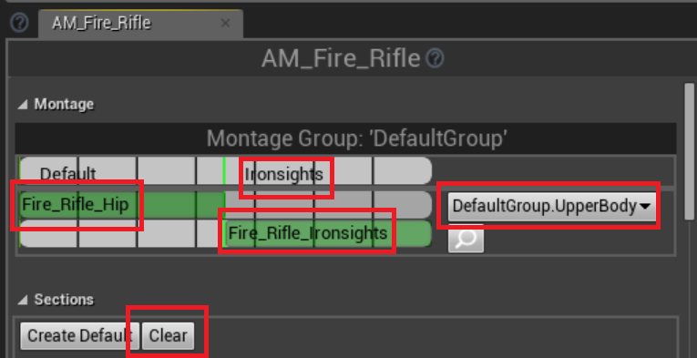

# アニメーションモンタージュ
* 発砲
    * AM_Fire_Rifle, AM_Fire_Shotgun を作成 (ライフルとショットガン用のモーションしかないので他は流用する)
        * DefaultGroup.UpperBody スロットを選択を選択する
        * それぞれ Fire_Rifle_Hip, Fire_Shotgun_Hip をドラッグ&ドロップ
        * それぞれ Fire_Rifle_Ironsights, Fire_Shotgun_Ironsights をドラッグ&ドロップ
            * セクション名 Ironsights を追加する
            * Clear を押す
    * 備考) 他に Prone_Fire_1, Prone_Fire_2 モーションがある(未使用)

    

* リロード
    * AM_Reload_Rifle, AM_Reload_Shotgun, AM_Reload_Pistol を作成 (ライフル、ショットガン、ピストル用しかないので他は流用)
        * DefaultGroup.UpperBody スロットを選択を選択する
        * それぞれ Reload_Rifle_Hip, Reload_Shotgun_Hip, Reload_Pistol をドラッグ&ドロップ
        * ピストル以外は Reload_Rifle_Ironsights, Reload_Shotgun_Ironsights をドラッグ&ドロップ
            * セクション名 Ironsights を追加する
            * Clear を押す
    * 備考) 他に Prone_Reload_Rifle, Prone_Reload_Shotgun モーションがある(未使用)

* 装備
    * AM_Equip_Rifle, AM_Equip_Pistol を作成 (ライフル、ピストル用しかないので他は流用)
        * DefaultGroup.UpperBody スロットを選択を選択する
        * それぞれ Equip_Rifle_Standing, Equip_Pistol をドラッグ&ドロップ
