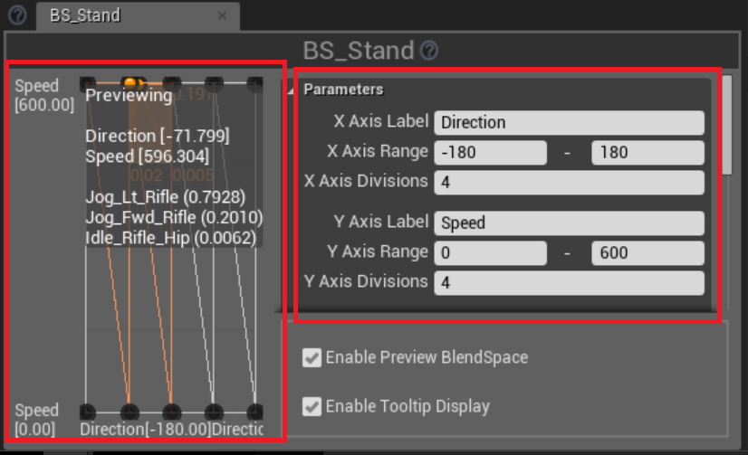
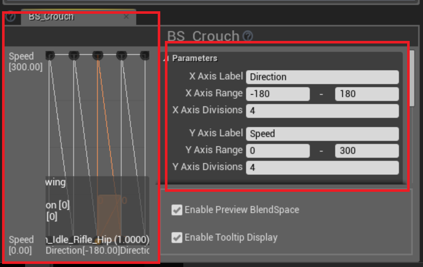

# ブレンドスペース

## ブレンドスペースの作成
* BS_Stand を作成
    * Idle_Rifle_Hip
    * Jog_Fwd_Rifle, Jog_Bwd_Rifle
    * Jog_Lt_Rifle, Jog_Rt_Rifle

* BS_Crouch を作成
    * Crouch_Idle_Rifle_Hip
    * Crouch_Walk_Fwd_Rifle_Hip, Crouch_Walk_Bwd_Rifle_Hip
    * Crouch_Walk_Lt_Rifle_Hip, Crouch_Walk_Rt_Rifle_Hip
